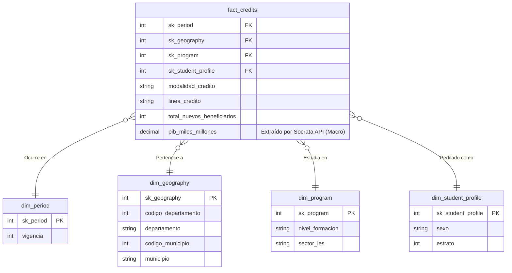

# ICETEX ETL Pipeline & Analytical Data Mart (Second Delivery)

Este repositorio contiene la evolución de la infraestructura de datos analíticos para la asignación de créditos del ICETEX, transformando una canalización manual estática (Primera Entrega) en un **Pipeline ETL Automatizado mediante Apache Airflow**, integrado con una API pública y validado estrictamente en calidad mediante **Great Expectations**.

---

## 1. Objetivos Refinados

**¿Por qué estamos construyendo este pipeline?**
El propósito inicial era comprender la distribución demográfica de los créditos educativos. Ahora, el objetivo refinado es **integrar el contexto macroeconómico regional** para determinar si existen efectos de "desplazamiento" socioeconómico en la asignación de recursos o correlacionar la demanda de educación superior estructurada con la fortaleza del Producto Interno Bruto (PIB) de cada región.

**¿Qué insights debe entregar la data?**
- Identificar la variación YoY (Year-Over-Year) del volumen de beneficiarios cruzados transversalmente contra los cambios en el PIB regional.
- Medir la cuota de penetración sectorial (Universidad Pública vs. Privada) según el músculo económico del territorio.

---

## 2. API Externa y Estrategia de Data Profiling

### Fuente Primaria (Primera Entrega)
- **Data**: Archivo histórico plano de Nuevos Beneficiarios del ICETEX.
- **Profiling Inicial**: Contenía inconsistencias semánticas en nombres de ciudades y falta de un esquema de integridad referencial duro. Las columnas esenciales (`VIGENCIA`, `DEPARTAMENTO`, `SECTOR`, `ESTRATO`) presentaban una forma en su mayoría estable pero carente de dimensionalidad.

### Nueva Fuente API (Segunda Entrega)
- **API Seleccionada**: API pública de Socrata proveída por Datos Abiertos - Colombia (`kgyi-qc7j`).
- **Data Extraída**: Producto Interno Bruto (PIB) Departamental, proyectado y calculado anualmente por el DANE.
- **¿Por qué fue elegida?**: Añade un enorme valor analítico. Otorgar dinero es dependiente del contexto económico territorial. El PIB mide la salud financiera, otorgando a los tomadores de decisiones del ICETEX una visión sobre correlaciones en morosidad, dependencia de subsidios estatales o crecimiento.

### Estrategia de Integración
Teníamos dos opciones: cruzar por códigos DIVIPOLA o por nombres en texto.
Dado que la fuente primaria no garantizaba coherencia de DIVIPOLA, nuestra estrategia de integración utiliza **Lógica de Matching Difuso (Fuzzy String Matching con `RapidFuzz`)**. 
Los nombres geográficos son extraídos, normalizados (removiendo acentos y pasando a mayúsculas) y luego emparejados matemáticamente (ej. "BOGOTÁ, D.C." frente a "BOGOTA"). Esto asegura una robusta alineación topológica sin pérdida accidental de records. Los parámetros macroeconómicos se incrustan como Dimensiones Degeneradas en la Tabla de Hechos.

---

## 3. Dimensional Model (Modelo de Estrella)

La estructura conserva el *Grain* de la primera entrega pero redefine sus alcances ante los nuevos parámetros.
- **Grain del modelo**: Un único registro (fila) resume el agregado total de nuevos beneficiarios para la amalgama de un Año, un Departamento y Municipio, un Nivel/Sector, Modalidad crediticia y variables sociodemográficas, enriquecido lateralmente con la variable del PIB del respectivo cruce espacio-temporal.

> **Nota de Impacto de la API**: A diferencia de modelos ortodoxos, incrustar la información macro directamente en la `fact_credits` elimina múltiples sub-tablas de medidas estáticas, reduciendo los joins por año y mejorando la tasa de ingesta.

---

## 4. Pipeline Orchestration (Apache Airflow DAG)

Todo el flujo de vida del dato está altamente automatizado:
1. `extract_icetex_csv` y `extract_macro_api`: Operaciones I/O Bound montadas en paralelo. La extracción de API implementa una paginación inteligente utilizando un límite optimizado.
2. `transform_and_merge`: Une amabas bases utilizando el cruce difuso, depura las incongruencias de formato, y elimina anomalías mediante un llenado analítico (Soft-fail en lugar de Hard Drop si una región carece temporalmente de dato del PIB).
3. `run_quality_checks`: Tarea encargada de la inútil contaminación cruzada del modelo utilizando compuertas de seguridad con las librerías construidas bajo Test-Driven Development (TDD).
4. `load_to_postgres`: Carga masiva aplicando inserciones optimizadas (`INSERT ON CONFLICT DO NOTHING`) sobre PostgreSQL.

---

## 5. Estrategia de Validación de Datos (Great Expectations)

Para que el modelo sea productivo, el paso por el **Data Quality Gate** es obligatorio. Las validaciones ocurren estricta y únicamente **DESPUÉS** de la transformación y **ANTES** de la carga en base de datos.
Todo este *Suite* (`setup_gx.py` & `validate_data.py`) determina la fiabilidad y salud vital del Data Warehouse. Ante el fallo de solo 1 parámetro crítico, Airflow suspende y marca la tarea como `FAILED`, impidiendo la inyección del dato sucio.

### Reglas de Expectación Implementadas:
| Regla | Tipo/Críticidad | Justificación |
|---|---|---|
| `expect_column_values_to_not_be_null` (Año) | **Crítico** | Previene fallos fatales de asignación temporal (integridad referencial en llaves foráneas para `dim_period`). |
| `expect_column_values_to_not_be_null` (Depto) | **Crítico** | Protege y sustenta tanto el análisis espacial como la correcta absorción contra `dim_geography`. |
| `expect_column_values_to_be_in_set` (Sector) | **Crítico** | Evita bifurcaciones lógicas restringiendo el sub-dominio obligatoriamente a: `OFICIAL`, `PRIVADO`, `NO CLASIFICADO`. |
| `expect_column_values_to_be_in_set` (Estrato) | Tolerante (95%) | Garantiza el enfoque analítico en el grupo social delimitado (Estratos 1 a 6) ignorando el ruido excesivo. |
| `expect_table_row_count_to_be_between` (Volume) | Alerta | Comprueba que luego del Join en memoria existan más de 50.000 filas (evita vacíos) y menos de 150.000 (previene fallos de cruce cartesiano perjudiciales en la base). |

---

## 6. Suposiciones (Assumptions) y Tratamiento Especial 

- **MacroData Incompleta**: Es posible que no existan datos de Producto Interno Bruto para todas las locaciones micro representadas por el ICETEX. El sistema está diseñado para mapearlo limpiamente a valores `NULL`, sin alterar ni eliminar la valiosidad del crédito estudiantil propio.
- **Idempotencia Absoluta**: Correr el pipeline 1 vez o 10.000 veces arrojará los mismos resultados estructurales (sin registros repetidos) gracias a la lógica interna del script de migración SQL dentro del DAG.
- **Modificaciones GX**: Dada la profunda deprecación en el ecosistema 1.0 de GX, el proyecto congeló controladamente los paquetes Python (`0.18.x`) previniendo drift de contexto entre ramas productivas y repositorios locales.

---

## 7. Dashboards, Vistas Materializadas y Analítica 

Una vez ingresados los datos, una vista super indexada llamada `mv_impacto_macro_desplazamiento` es recreada mediante Airflow. Encapsula en sí misma Funciones de Ventana (*Window Functions*) puras en PostgreSQL para deducir la métrica interanual sin exigir cómputo masivo al motor de Inteligencia de Negocios.

*(Nota: Pantallazos pendientes de agregar una vez construidas y validadas las visualizaciones analíticas finales en la conexión en directo de Tableau/Power BI).*
